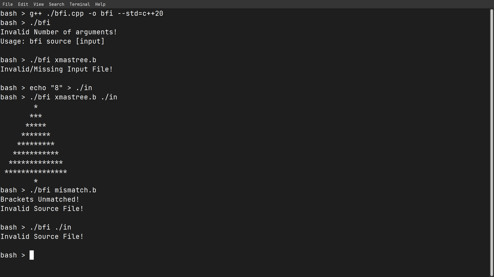

+ A simple two-pass interpreter for BrainFuck programming language written in C++
+ Allows reading from input and raises simple warnings for common errors.
+ BF code is parsed into an intermediary where commands like `+++++` are replaced with `{+,5}`

